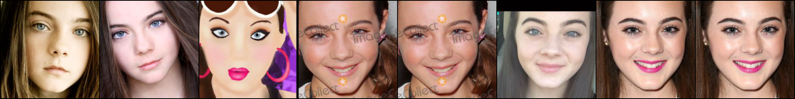
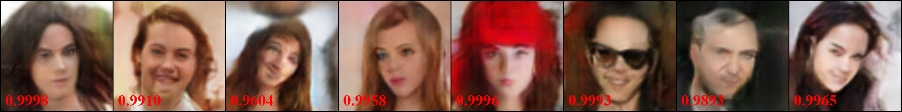
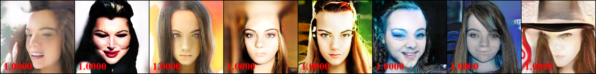
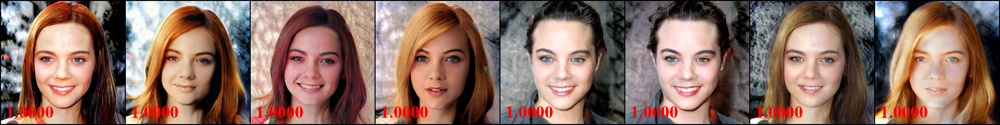
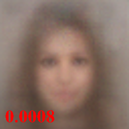
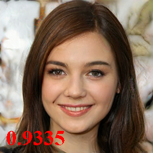

## VGG16 pre-trained on VGGFACE, label 178

Index: [HOME](../../../../) / [VGGFACE](../../) / [VGG16](../) / label 178

Red numbers denote the target confidence. For the white-box inversion, we run with a batch size of 8. For the black-box inversion, AMI only returns 1 image so we only generates 1 image.

### Target Person

8 images with the largest file size from the training data

### GMI (white-box)

### PGGAN (white-box)

### MIRROR (ours white-box)

### AMI (black-box)

### MIRROR (ours black-box)

