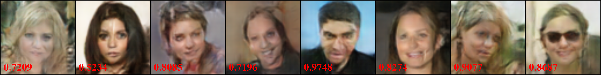
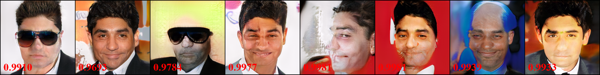
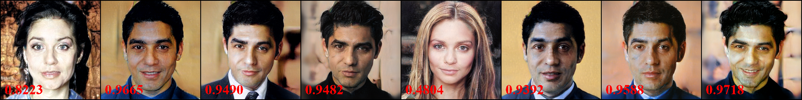
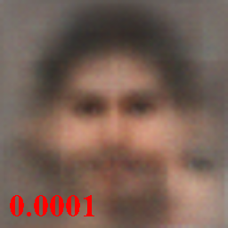
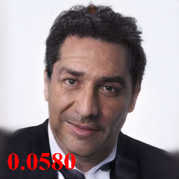

## Inception Resnet (V1) pre-trained on VGGFACE2, label 29

Index: [HOME](../../../../) / [VGGFACE2](../../) / [Inception Resnet (V1)](../) / label 29

Red numbers denote the target confidence. For the white-box inversion, we run with a batch size of 8. For the black-box inversion, AMI only returns 1 image so we only generate 1 image.

### Target Person

8 images of the target person with the largest file size from VGGFACE2

### GMI (white-box)

### PGGAN (white-box)

### MIRROR (ours white-box)

### AMI (black-box)

### MIRROR (ours black-box)

