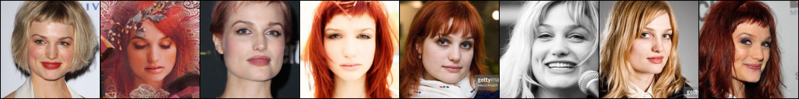
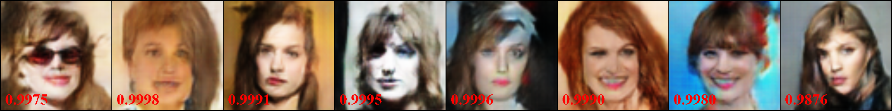
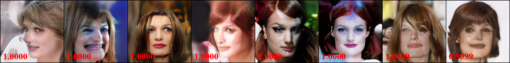
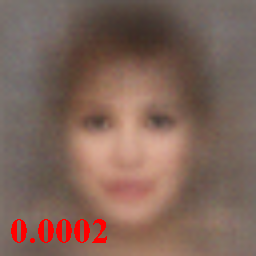
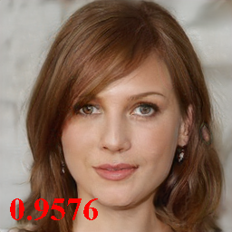

## ResNet50 pre-trained on VGGFACE2, label 0

Index: [HOME](../../../../) / [VGGFACE2](../../) / [ResNet50](../)

### Target person

### GMI (white-box)

### PGGAN (white-box)

### MIRROR (ours white-box)

### AMI (black-box)

### MIRROR (ours black-box)

