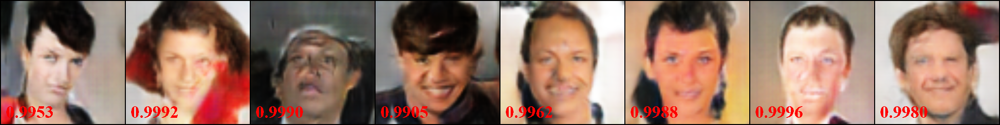
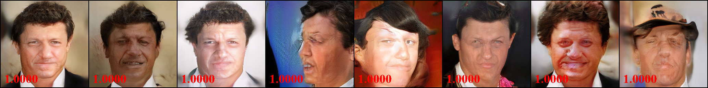
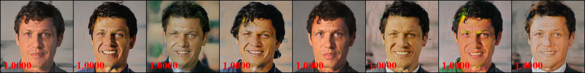
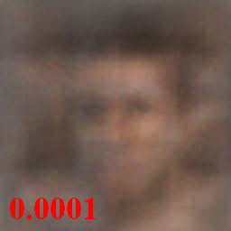
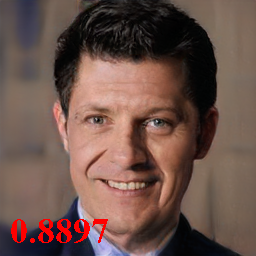

## ResNet50 pre-trained on VGGFACE2, label 95

Index: [HOME](../../../) | [{dataset_name}](../../) | [{arch_name}](../)

### Target person

### GMI (white-box)

### PGGAN (white-box)

### MIRROR (ours white-box)

#### AMI (black-box)

### MIRROR (ours black-box)

